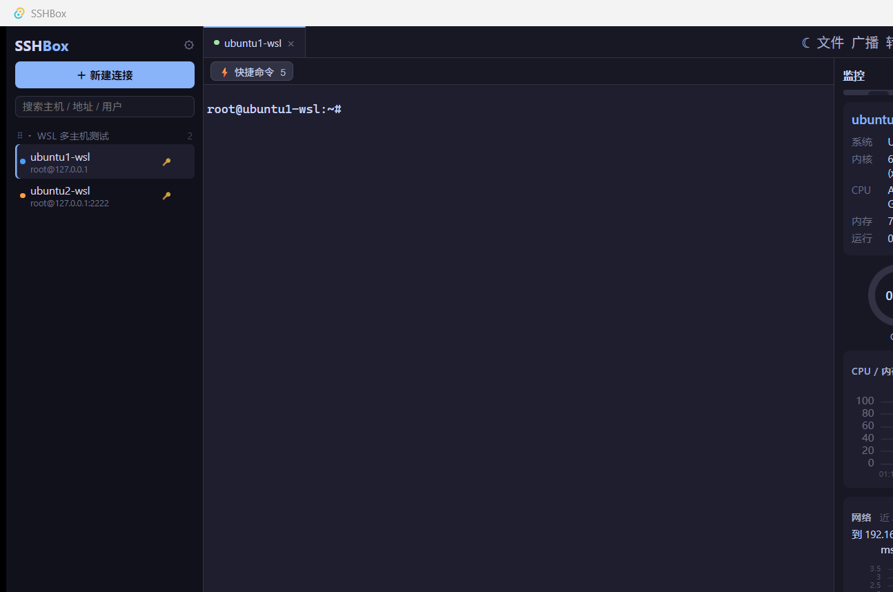

# SSHBox

**Windows 桌面 SSH 终端 + 虚拟机实时监控工具**（类 MobaXterm / Xshell 的轻量替代）

Tauri 2 + Vue 3 + Rust 构建的原生桌面应用，安装包约 5 MB，内存占用远低于 Electron 系终端。



## 功能

- **SSH 终端**：多会话标签页、保存主机、一键连接、命令只填入终端不自动执行（回车由你按）
- **实时监控**：侧边栏主机状态（在线/离线）、CPU / 内存 / 磁盘 / 负载曲线、网络时延与丢包（默认网关实测）、告警与解除事件
- **AI 助手**：接入 OpenAI 兼容接口（含 Ollama 本地模型），生成命令/解释输出/分析故障，密钥存 Windows 凭据管理器，明文不回传不落盘
- **故障日志**：崩溃现场直写（panic hook + 前端全局异常捕获）、异常退出标记按 PID 追踪、启动环境快照（OS / WebView2 / 配置）、日志自动轮转（默认 5 MB，`SSHBOX_LOG_MAX_BYTES` 可覆盖）
- **报告**：监控数据导出自包含 HTML 报告（无 CDN 依赖）

## 安装

从 [Releases](https://github.com/Xingzhewujiang2017/sshbox-terminal/releases) 下载：

- `SSHBox_x.x.x_x64-setup.exe` — NSIS 安装包（需要 [WebView2 运行时](https://developer.microsoft.com/microsoft-edge/webview2/)，Windows 11 自带）
- `SSHBox-x.x.x-绿色版.exe` — 免安装绿色版，双击即用

数据存 `%APPDATA%\sshbox\`（主机列表 / 设置 / 历史 SQLite），日志在 `%LOCALAPPDATA%\com.z.sshbox\logs\`。

## 从源码构建

环境：Rust（stable）+ Node.js 18+ + Windows（本项目仅在 Windows 上测试）。

```bash
npm install
npm run tauri build        # 出包：src-tauri/target/release/sshbox.exe + NSIS 安装包
```

> ⚠️ **构建铁律**：release 构建必须带 `custom-protocol` feature。
> `npm run tauri build` 会自动传；但裸 `cargo build --release` **不会**，产物会导航到 devUrl 整页白屏（ERR_CONNECTION_REFUSED）。
> 裸 cargo 构建请用：
> ```bash
> cd src-tauri && cargo build --release --features custom-protocol
> ```
> 构建后自查：`grep cargo:dev target/release/build/tauri-*/output` 最新一条应为 `cargo:dev=false`。

开发模式：`npm run tauri dev`（前端热更新，Vite :1420）。

## 测试

```bash
npx vue-tsc --noEmit        # 前端类型检查
npm run test:ts             # 前端单测
cd src-tauri && cargo test --lib   # Rust 单测（140+ 项）
```

端到端冒烟测试（CDP 驱动真实 UI，含 WSL/虚拟机的 SSH 连通性用例）在 `.dev/` 下，未随仓库分发。

## 技术栈

| 层 | 选型 |
|---|---|
| 桌面框架 | Tauri 2（Rust + WebView2） |
| 前端 | Vue 3 + TypeScript + Vite |
| 后端 | Rust（axum 风格命令层 / 监控采样 / SQLite 历史） |
| 采集口径 | 只读 `/proc`、`/sys` 与命令输出；端口检查走默认网关实测，拿不到就不显示，不编造 `0 ms` |

## 许可

[MIT](LICENSE) © 2026 sshbox contributors